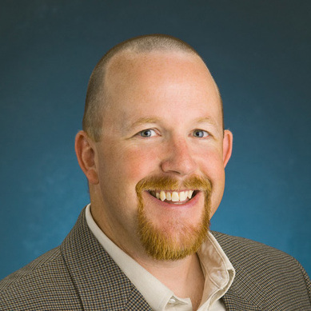
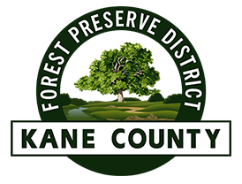
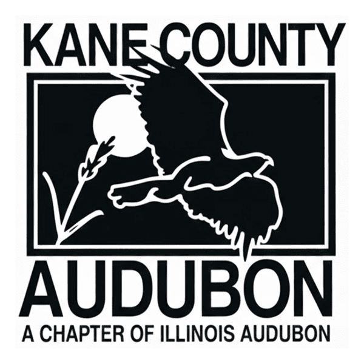
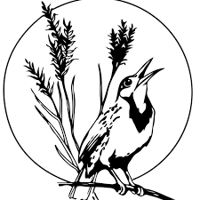

Since the early 1800s, Illinois has lost approximately 85% of its wetlands, part of a broader trend of wetland loss both across the US and globally. In addition to habitat loss, remaining wetland habitat is often degraded through agricultural drainage, providing poorer foraging opportunities for migratory waterbirds. For shorebirds, these problems are amplified by the relative rarity of their preferred wetland type in the state: mudflats and shallow wetlands. Only 4 to 6% of all wetland areas in Illinois are estimated to be mudflats. 

Given rarity of shorebird habitat in Illinois, our project proposes to investigate a new method of shorebird habitat management – creating shallow seasonal wetlands for migratory shorebirds by partially flooding agricultural fields. Specifically, we aim to create wetlands to provide habitat for small shorebirds, with a focus on the genera Calidris (sandpipers), Tringa (yellowlegs), and Limnodromus (dowitchers). We plan to install water control structures to restrict water drainage and allow portions of agricultural fields to flood. Water levels at each site will be managed to maintain shallow water levels ideal for migratory shorebirds. Sites will be monitored to evaluate shorebird use during migration. We will also assess soil invertebrate biomass, vegetation characteristics, pesticide concentrations, and the landscape surrounding each site to quantify food availability and site suitability. This data will be used to develop best practices for creating stopover habitat for migratory shorebirds in the Midwest and study the efficacy of these flooded agricultural fields as stopover habitat. Results of this work can be used by landowners to manage their properties for stopover habitat throughout the heavily modified ecosystems of the Midwest, helping support the conservation of migratory shorebirds.

\

::: {style="text-align: center;"}
## People
:::

::: {.home-section}

:::: {.columns}

::: {.column width="64%"}

::: {style="text-align: center;"}
### Alex Smilor 
:::

Alex Smilor is a Research Assistant and incoming Master's Student with the Ward Lab of Ornithology at the University of Illinois Urbana-Champaign. In his current role, his work focuses on leveraging Spring Bird Count data to track long term phenological changes, mapping rail migration throughout the Midwest, and assisting with the management of the Illinois Motus network. He has a Bachelor's of Science in Ecosystem Science and Sustainability from Colorado State University and has worked on projects studying Kirtland's Warbler breeding behavior, subalpine forest recovery and resilience, and climate change's effects on Gentoo Penguin breeding phenology. Beyond work, he is an avid user of eBird and iNaturalist and enjoys spending time in the outdoors running, hiking, and doing photography. 
:::

::: {.column width="2%"}
:::

::: {.column width="34%"}

:::

::::

:::
::: {.home-section}

:::: {.columns}

::: {.column width="34%"}

:::

::: {.column width="2%"}
:::

::: {.column width="64%"}

::: {style="text-align: center;"}
### Dr. Michael P. Ward
:::

Dr. Mike Ward is originally from Jacksonville, IL and received his PhD from the University of Illinois, Urbana-Champaign in 2004. He is currently the Stuart L. and Nancy J. Levenick Chair in Sustainability in the Department of Natural Resources and Environmental Sciences, in the College of Agricultural, Consumer, and Environmental Sciences at the University of Illinois and an Ornithologist at the Illinois Natural History Survey. He and his students are working on a variety of projects throughout the Midwest but also in Texas, Mexico, Colombia, and Cuba. In summary, Dr. Ward studies the ecology and behavior of birds in natural and modified ecosystems in order to inform conservation and management.
:::

::::

:::

::: {style="text-align: center;"}
## Our Collaborators

We would like to give special acknowledgements to all of our collaborators and funders, who have provided valuable financial and logistical support needed to run this project.
:::

::: {style="text-align: center; fig-align: center;"}

::: {.home-section}

:::: {.columns}

::: {.column width="49%"}

#### Forest Preserve District of Kane County
{width=25%}

#### Illinois Audubon Society
{width=25%}
:::

::: {.column width="2%"}
:::

::: {.column width="49%"}

#### Kane County Audubon Society
{width=25%}

#### Champaign County Audubon Society
{width=25%}
:::

::::

:::

:::