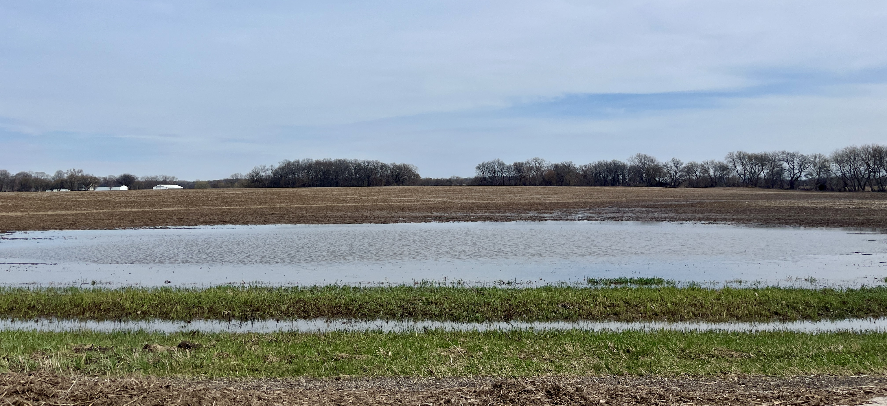
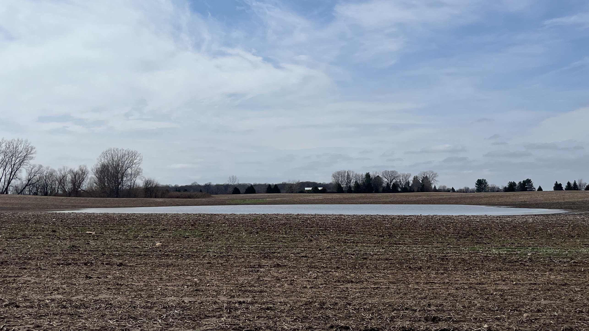
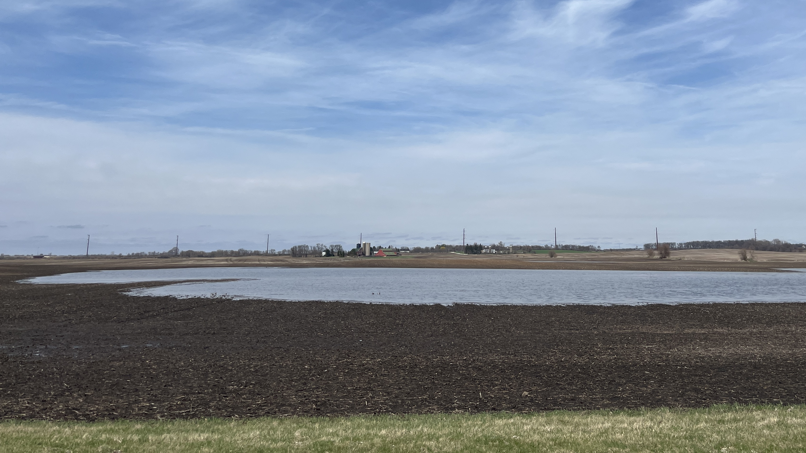

::: {style="text-align: center;"}
# Welcome to The Fluddle Project!

{fig-align="center"}

Birdwatchers throughout the midwest have long understood the value that fluddles, the low-lying regions of fields that often flood following spring rains, play in the life cycles of migratory shorebirds. Every spring, thousands of shorebirds representing more than two dozen species stopover in flooded agricultural fields on their annual journeys northward toward their breeding grounds.

And yet, we have very little concrete data on how many shorebirds use this unique habitat and what makes a fluddle an attractive and productive stopover site for the migratory shorebirds that choose to stopover there.

This project plans to study those exact questions over the course of the next few years.

And we need your help!

We are looking for interested birdwatchers across Illinois to regularly conduct point count surveys at fluddles. These surveys can be conducted at any fluddle site in the state, although we have a few high-priority sites. A simple survey protocol has been developed to help us standardize and collect the data through the eBird platform.
:::

`

[{width="25%" fig-align="center"}](https://docs.google.com/forms/d/e/1FAIpQLSeOYdFTQ_OYpSBaCFCOB77vY95g8p39Mm_LFp6q3HyMHbBNdw/viewform?usp=dialog)

::: {.home-section}

:::: {.columns}

::: {.column width="49%"}
```{=html}
<a href="protocols.qmd">
  <div class="image-wrapper">
    
    <div class="image-overlay">
      <p style="font-size: 30px"><b>How to Survey</b></p>
    </div>
  </div>
</a>
```
:::

::: {.column width="2%"}
:::

::: {.column width="49%"}
```{=html}
<a href="sites.qmd">
  <div class="image-wrapper">
    
    <div class="image-overlay">
      <p style="font-size: 30px"><b>Site Information</b></p>
    </div>
  </div>
</a>
```
:::

::::

:::

::: {style="text-align: center;"}
## Explore Our Sites!

The map below shows all of the fluddle sites that have been located as part of this project. Locations marked with a red star are High Priority monitored sites where we are collaborating with the landowner to collect data. Each point marks the suggested location from which you should survey that fluddle and we provide a rough estimate of the flooding extent of each site. Sites marked with a blue dot represent all other fluddle sites that have been identified by volunteers.
:::
```{=html}
<!-- Add script to the <head> of your page to load the embeddable map component -->
<script type="module" src="https://js.arcgis.com/5.0/embeddable-components/"></script>
<!-- Add custom element to <body> of your page -->
 <arcgis-embedded-map style="height:600px;width:100%;" item-id="0a19ffdf130e490a854a26fb5ab399d8" theme="light" legend-enabled basemap-gallery-enabled time-zone-label-enabled center="-88.61411703710857,40.951509252964115"scale="2311162.217155" portal-url="https://univofillinois.maps.arcgis.com"></arcgis-embedded-map>
```