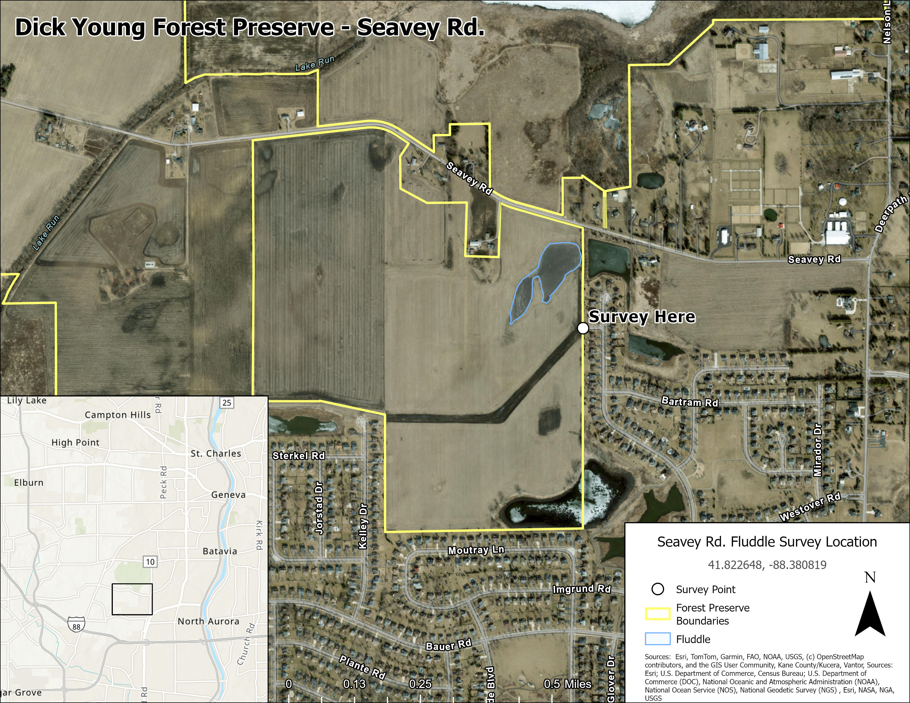
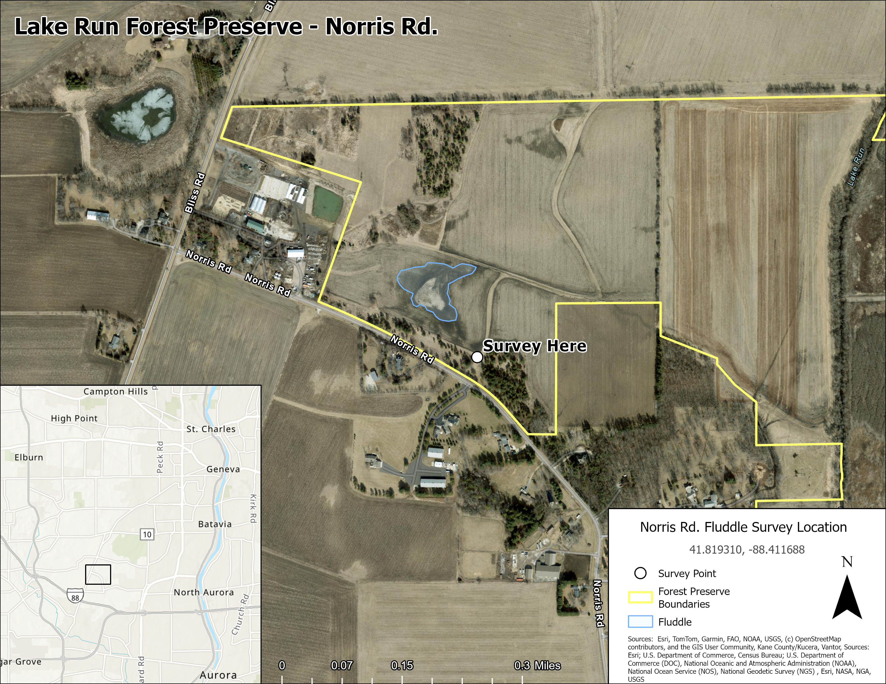
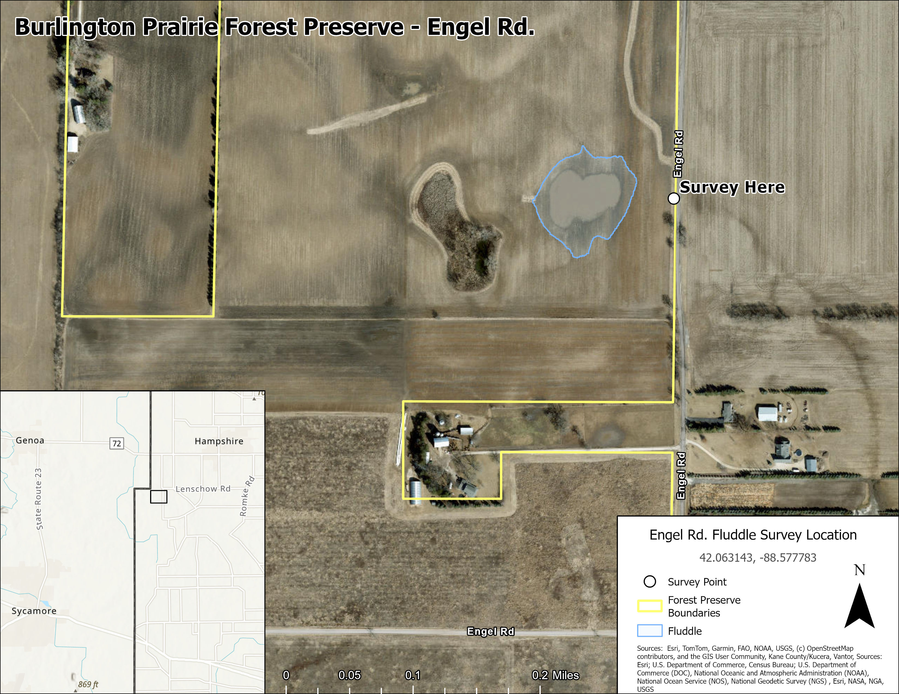

::: {style="text-align: center;"}
# Site Information

There are two types of sites being studies in this project, which we're calling high and low priority sites. **High priority** sites are specific fluddles where we plan to collect information about the physical and biological characteristics about the site. All of the high priority sites are on land where we have the explicit permission of the landowner to work and where we have explicit permission to monitor. If you live or bird near one of our high-priority sites, we strongly encourage that you survey these sites, since your data will have the most impact.

**Low priority** sites are just any other fluddles that you decide to visit and use our protocol at. While we won't be carefully tracking these sites throughout migration, data collected from these sites can be used to help us answer other questions.
:::

::: callout-important
Please **exercise caution** when surveying at these locations. Many of the sites are located near or on roads, which may be busy. If you feel unsafe at a location for any reason, please do not continue to survey. **Your safety is more important than the data.** Where possible, survey points were placed in locations with sufficient area to park a car safely off the road, though this may not be the case at all sites.

Additionally, please **do not block farm access lanes or enter fields**. Additionally, if farmers are applying pesticides, please avoid surveying the area for your own health.
:::

::: {style="text-align: center;"}
For more information about the scientific goals of this project, please see the [about](about.qmd) page.

## Site Map

The map below shows all of the fluddle sites that have been located as part of this project. Locations marked with a red star are high priority monitored sites where we are collaborating with the landowner to collect data. Each point marks the suggested location from which you should survey that fluddle and we provide a rough estimate of the flooding extent of each site. Sites marked with a blue dot represent all other fluddle sites that have been identified by volunteers.

```{=html}
<!-- Add script to the <head> of your page to load the embeddable map component -->
<script type="module" src="https://js.arcgis.com/5.0/embeddable-components/"></script>
<!-- Add custom element to <body> of your page -->
 <arcgis-embedded-map style="height:600px;width:100%;" item-id="0a19ffdf130e490a854a26fb5ab399d8" theme="light" legend-enabled basemap-gallery-enabled time-zone-label-enabled center="-88.61411703710857,40.951509252964115"scale="2311162.217155" portal-url="https://univofillinois.maps.arcgis.com"></arcgis-embedded-map>
```

## High Priority Sites

There are currently 3 high priority sites that we will be monitoring during the 2026 spring season. Each site is described in detail below. We plan to add a few more sites, so check back regularly.
:::

::: {.home-section}

:::: {.columns}

::: {.column width="49%"}
### Seavey Rd. Fluddle
- Dick Young Forest Preserve, Kane County
-   41.822648, -88.380819
-   **Google Maps Pin:** <https://maps.app.goo.gl/4MWMXh9gofKDb8K4A>
-   **eBird Hotspot:** <https://ebird.org/hotspot/L7929112>
:::

::: {.column width="2%"}
:::

::: {.column width="49%"}
{.lightbox group="maps" fig-alt="A map showing the boundary of a forest preserve, the estimated extent of a fluddle, and the survey point for the site"}
:::

::::

:::
::: {.home-section}

:::: {.columns}

::: {.column width="49%"}
{.lightbox group="maps" fig-alt="A map showing the boundary of a forest preserve, the estimated extent of a fluddle, and the survey point for the site"}
:::

::: {.column width="2%"}
:::

::: {.column width="49%"}
### Norris Rd. Fluddle
- Lake Run Forest Preserve, Kane County
- 41.819310, -88.411688
- **Google Maps Pin:** <https://maps.app.goo.gl/re9HuaDknAtDHVjz5>
- **eBird Hotspot:** <https://ebird.org/hotspot/L61395335>

::: callout-important
Please do not park in the access lane! We don't want to obstruct the farmer's access to the field. Please park either along the road or in the grassy area by the treeline to the east of the access lane.
:::

:::

::::

:::
::: {.home-section}

:::: {.columns}

::: {.column width="49%"}
### Engel Rd. Fluddle
- Burlington Prairie Forest Preserve, Kane County
- 42.063143, -88.577783
- **Google Maps Pin:** <https://maps.app.goo.gl/MvbK2Br1ZMPD3fqNA> 
- **eBird Hotspot:** <https://ebird.org/hotspot/L61395562>
:::

::: {.column width="2%"}
:::

::: {.column width="49%"}
{.lightbox group="maps" fig-alt="A map showing the boundary of a forest preserve, the estimated extent of a fluddle, and the survey point for the site"}
:::

::::

:::

We plan to add more high-priority sites as the project continues, so check back here occasionally.